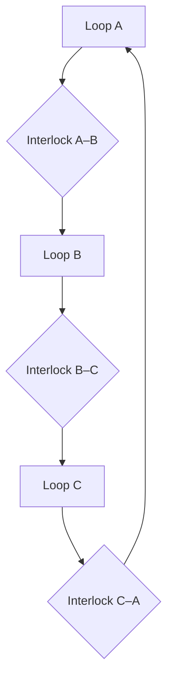
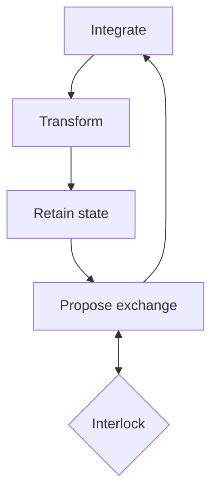

> **Superloop repository provenance:** This v0.1 paper originated in the Aurora / ORIONCORE working context but was designated as a distinct, independent architecture at inception. The original workspace label is preserved below for historical accuracy only. No Aurora canon, authority, runtime dependency, or compatibility claim is inherited by Superloop Workshop.

**CONCEPT ARCHITECTURE WHITE PAPER**

The Conduit Barrier Field

A Topological Architecture for Distributed, Equilibrium-Governed
Computation

*Local closure · Relational openness · Field-level equilibrium*

**Originator:** Travis Levi Streets

**Workspace:** Aurora / ORIONCORE — Concept Architecture Series

**Version:** v0.1 — Foundational formulation

**Date:** 10 July 2026

**Status:** Exploratory architecture — distinct concept; not canonical

*This paper defines a research architecture. It does not assert a
completed implementation, physical equivalence to thermodynamics, or
demonstrated computational advantage.*

# Contents at a Glance

- Abstract and architectural thesis

- 1\. Motivation: from autonomous loops to a computational field

- 2\. Core definitions and boundary of the proposal

- 3\. Structural model: loop, interlock, and field

- 4\. Operational model: pressure, flow, gates, and conservation

- 5\. The field as barrier and conduit

- 6\. Field thermodynamics as a distributed operating layer

- 7\. Neural-style and equilibrium computation

- 8\. Safety, liveness, security, and governance

- 9\. Relationship to established computational models

- 10\. Implementation pathways and research program

- 11\. Limitations, non-claims, and open questions

- Appendices: interface contract, proof obligations, and bridge boundary

**Reading note** The visual language of interlocking rings of light is
treated as a faithful representation of topology: each ring remains
locally closed, each interlock creates a governed relationship, and the
full mesh behaves as both a protected membrane and an
information-bearing field.

# Abstract

This paper introduces the Conduit Barrier Field (CBF), a proposed
architecture in which computation occurs through a field of
interlocking, recurrent units. Each Conduit Barrier Loop (CBL) is a
self-contained cyclic process with local state, capacity, invariants,
and one or more standardized ports. Where loops interlock, a shared
junction regulates exchange through validation, translation, capacity
signaling, accounting, and reciprocal feedback. The same topology
therefore produces two apparently opposed behaviors: it acts as a
barrier against unmediated traversal and as a conduit for information
that satisfies local and relational conditions.

The proposal replaces a logically central scheduler with local
interaction laws. Workload is represented as pressure relative to
capacity; permitted exchange is represented as gated flow; congestion
produces backpressure; unsupported state decays; and system-wide
behavior emerges through local conservation, dissipation, entrainment,
and fault isolation. Under this model, the operating layer becomes
constitutional rather than executive: it specifies the physics under
which computation may organize itself instead of assigning every
operation to a predetermined processor.

The CBF is not presented as an entirely new primitive. It combines and
extends ideas found in Petri nets, cyclic dataflow, local barriers,
self-stabilizing distributed systems, fluid stochastic models,
graph-based neural computation, and equilibrium learning. Its
potentially distinctive contribution is the synthesis: recurrent modular
units whose interlocks simultaneously perform transport, validation,
resource regulation, and boundary formation. This document defines the
architecture, proposes a minimal mathematical model, identifies safety
and liveness requirements, and establishes a staged research program.

**Architectural thesis** The barrier and the conduit are not separate
components. They are two behaviors of the same regulated topology.

# 1. Motivation

## 1.1 From persistent loops to mutually regulated loops

Contemporary loop engineering emphasizes persistent agentic workflows: a
system acts, observes evidence, revises its state, and continues until a
stopping condition is satisfied \[1\]. Persistence is useful, but an
isolated loop can overrun resources, validate itself, duplicate
neighboring work, or continue after the surrounding system has lost the
capacity to absorb its output. Adding a central coordinator can control
those risks, but it restores a single logical bottleneck and places
global scheduling knowledge in one process.

The CBF begins from a different question: what if autonomous loops were
unable to advance across consequential boundaries until they received
fresh feedback at the places where they intersected neighboring loops?
The loop could continue internal observation or preparation, but
promotion of state would be governed by relationships rather than
unilateral persistence. Workload would then be regulated through locally
visible capacity, validation, and resistance.

## 1.2 Compute as habitable field capacity

In a field-native system, the economic unit of computation shifts from
execution on a named processor toward the provision of stable
computational space. A task enters as a pattern of state, constraints,
required relationships, and desired equilibria. The substrate supplies
enough memory, connectivity, energy, trust, and validation capacity for
that pattern to form. Hardware remains necessary, but applications do
not require a fixed route through particular infrastructure at the
logical level.

This reframing does not make compute cost disappear. It relocates cost
into occupancy, communication resistance, verification burden,
dissipation, latency, redundancy, and the stability margin required to
keep a field region viable. A compatible pattern may settle cheaply into
available capacity; an adversarial or highly synchronized pattern may be
expensive because it produces congestion, contention, or corrective
work.

# 2. Core Definitions and Scope

Table 1. Foundational terminology.

| **Term**                        | **Definition**                                                                                                                                                                 |
|---------------------------------|--------------------------------------------------------------------------------------------------------------------------------------------------------------------------------|
| **Conduit Barrier Loop (CBL)**  | A recurrent computational unit with local state, capacity, invariants, and standardized interlock ports.                                                                       |
| **Interlock**                   | A shared transition surface between loops that validates, translates, admits, accounts for, and returns feedback about exchange.                                               |
| **Conduit**                     | The transport behavior of an interlock when its admission conditions are satisfied.                                                                                            |
| **Barrier**                     | The containment behavior of an interlock or field when traversal conditions are not satisfied.                                                                                 |
| **Conduit Barrier Field (CBF)** | A topology of interlocking CBLs whose local closures and regulated exchanges create distributed flow and an emergent system boundary.                                          |
| **Field pressure**              | A normalized measure of unresolved workload or demand relative to available local capacity.                                                                                    |
| **Field thermodynamics**        | An operational analogy and mathematical design language for pressure, flow, resistance, storage, dissipation, and equilibrium; not a claim of physical thermodynamic identity. |

## 2.1 What the proposal claims

- A uniform recurrent unit can support unbounded composability if it
  requires only local knowledge, standardized ports, and bounded
  interaction rules.

- Local barriers combined with bounded conduits and backpressure can
  regulate advancement and admission without a central scheduler in the
  logical hot path.

- The topology can form both a security boundary and an information
  pathway because every permitted route crosses governed intersections.

- Neural-style integration, inhibition, memory, attention, entrainment,
  and local plasticity can be expressed through loop state and interlock
  behavior.

## 2.2 What the proposal does not yet claim

- That a CBF implementation currently exists or outperforms centralized
  systems.

- That local equilibrium automatically guarantees global correctness,
  fairness, or safety.

- That the field eliminates physical infrastructure, operating systems,
  or centralized services at lower layers.

- That every workload benefits from decentralization or
  equilibrium-based execution.

- That the phrase unbounded compatibility means literal infinite
  capacity; it refers only to a compositional rule that does not require
  global knowledge from each new unit.

# 3. Structural Model

Figure 1. Conceptual topology of a Conduit Barrier Field. Rings retain
local closure; gold junctions represent governed interlocks; the dashed
perimeter represents the system boundary emerging from the mesh rather
than from one central wall.

## 3.1 The atomic ring

A CBL is a closed computational cycle. Closure gives the unit a
persistent identity and a natural place for recurrent state. The ring
does not imply a fixed number of internal stages; it asserts that local
work returns to a state from which another cycle may begin. A minimal
unit can be described as:

CBLᵢ = {xᵢ, fᵢ, Cᵢ, Pᵢ, Gᵢ, Eᵢ}

x: state · f: local transition rule · C: capacity · P: ports · G: gate
policy · E: compute/energy budget

The implementation of the unit may be software, electronic, optical,
mechanical, fluidic, biological, or hybrid. Compatibility belongs to the
interface contract rather than to the internal substrate. Two units can
interlock if they can exchange typed state, capacity information,
provenance, and feedback under mutually intelligible rules.

Figure 2. Minimal CBL anatomy. The loop integrates, transforms, retains,
and proposes state. Its ports expose only governed interaction surfaces;
the interlock performs relational work that neither loop performs
unilaterally.

## 3.2 The interlock as a shared computational surface

An interlock is not merely a network edge. It belongs to the
relationship between loops and carries state of its own. At minimum it
records the participants, message schema, admissibility rules,
downstream capacity, freshness window, provenance requirements, and
outstanding reciprocal obligations. It may be binary, continuously
weighted, quorum-gated, or phase-sensitive.

- **Validation —** determine whether proposed state satisfies the
  receiving relationship.

- **Translation —** convert representation without silently changing
  meaning or provenance.

- **Admission —** prevent transfer when downstream capacity is exhausted
  or reserved.

- **Accounting —** conserve credits, obligations, resource use, and
  causality metadata.

- **Reciprocity —** return acceptance, rejection, pressure, exception,
  or revision feedback.

## 3.3 The field and its emergent boundary

The field is a graph whose nodes are recurrent units and whose edges or
hyperedges are interlocks. The field becomes a barrier when every path
from one protected region to another crosses one or more governed
interlocks. In graph-theoretic terms, the interlocks form distributed
cut sets. No single unit must defend the whole field, because the
topology makes unmediated traversal structurally unavailable.

The same graph becomes a conduit when an admissible path exists. Valid
state can travel globally through repeated local exchanges even though
no ring maintains a complete map. This creates local closure with
relational openness: identity is preserved inside a unit, while
influence is possible through explicit, reciprocal boundaries.

# 4. Operational Model

## 4.1 Pressure and capacity

Let qᵢ denote unresolved workload at loop i and Cᵢ its effective
capacity. A normalized pressure signal is:

pᵢ(t) = qᵢ(t) / Cᵢ(t)

Pressure is relational: the same workload produces different pressure
under different available capacity.

Pressure may combine several dimensions rather than one scalar: memory
occupancy, compute demand, validation debt, uncertainty, latency, trust
budget, or thermal and energy constraints at the physical layer. A
production model would define a vector pressure or a typed set of
potentials and prohibit unsafe dimensional collapse.

## 4.2 Gate state

For an interlock between loops i and j, define a gate state:

gᵢⱼ(t) = Aᵢⱼ ∧ Fᵢⱼ ∧ Hⱼ ∧ Vᵢⱼ

A: authorized relationship · F: fresh reciprocal feedback · H:
downstream headroom · V: validation satisfied

The Boolean form is the strictest case. A continuous form can represent
permeability in \[0,1\], while a quorum function can require an
appropriate subset of neighboring validators. Safety-critical promotion
may require unanimity; ordinary transport may require one authorized
receiver with sufficient capacity.

## 4.3 Flow and conservative transfer

Qᵢⱼ(t) = gᵢⱼ(t) · \[pᵢ(t) − pⱼ(t)\] / Rᵢⱼ(t)

Q: permitted flow · R: resistance induced by bandwidth, latency, trust,
translation, or verification cost

dpᵢ/dt = Sᵢ − Σⱼ Qᵢⱼ − λᵢpᵢ

S: externally admitted work · λ: controlled decay or release of
unsupported state

A discrete implementation can move tokens or credits instead of
continuous fluid. The conservation rule remains: accepted transfer
removes a corresponding obligation from the sender and creates a
traceable state or obligation at the receiver. Transfer must not
silently duplicate authority, erase provenance, or produce unbounded
work.

## 4.4 Dissipation and cost

Dᵢⱼ = Qᵢⱼ(pᵢ − pⱼ) = RᵢⱼQᵢⱼ²

Dissipation is proposed as a better cost signal than raw flow alone:
productive high-conductance flow need not be penalized merely for moving
information.

A field-native cost model would include occupied capacity over time,
dissipation, verification, redundancy, communication distance, and
instability introduced. The model must remain empirical: these
quantities are design variables until calibrated against a real
implementation.

# 5. Barrier–Conduit Duality

A conventional barrier and a conventional channel are often implemented
as separate mechanisms. In the CBF, an interlock is a semipermeable
computational membrane. Its state determines whether the same
relationship behaves as resistance or conductance. A closed gate does
not merely stop traffic; it returns meaningful state such as wait,
revise, reroute, reduce, isolate, or escalate. An open gate transfers
state and returns evidence of reception or incorporation.

Table 2. The same interlock viewed as barrier and conduit.

| **Interlock condition** | **Barrier behavior**                                   | **Conduit behavior**                              |
|-------------------------|--------------------------------------------------------|---------------------------------------------------|
| **Validation**          | Rejects malformed, unsafe, or incoherent state         | Passes state that satisfies relational invariants |
| **Capacity**            | Propagates backpressure when the receiver is saturated | Admits flow when bounded headroom exists          |
| **Identity and trust**  | Prevents unrecognized or unauthorized traversal        | Establishes a typed, attributable relationship    |
| **Freshness**           | Blocks stale acknowledgments and replayed permissions  | Allows time-bounded progress on current evidence  |
| **Provenance**          | Refuses state whose lineage cannot be established      | Carries causal and transformation history forward |
| **Failure**             | Isolates or degrades a damaged region                  | Reroutes through viable neighboring relationships |

**Critical distinction** A barrier controls advancement, but it does not
by itself prevent upstream accumulation. Overrun protection requires
bounded conduits, admission control, and backpressure in addition to
gating.

# 6. Field Thermodynamics as an Operating Layer

A traditional operating system is executive: it assigns resources,
schedules processes, manages memory, and routes communication. A
field-native operating layer is constitutional: it defines local
conservation laws, prohibited states, interaction contracts, and
recovery behavior. Computation then organizes itself within those laws.
The term field thermodynamics names this control model; it does not
imply that software state is literally a physical fluid.

Table 3. Conventional operating functions translated into field
behavior.

| **Operating function**         | **Field realization**                                                                                 |
|--------------------------------|-------------------------------------------------------------------------------------------------------|
| **Scheduling**                 | Work moves according to readiness, pressure gradients, priority potentials, and available headroom.   |
| **Memory allocation**          | Loops occupy and release bounded local state-space; persistence has an explicit replenishment cost.   |
| **Interprocess communication** | State crosses typed, reciprocal interlocks rather than ungoverned channels.                           |
| **Load balancing**             | Backpressure and pressure gradients redirect admissible work toward underused regions.                |
| **Isolation**                  | Loop closure and interlock gates contain faults, uncertainty, and untrusted state.                    |
| **Access control**             | Permeability depends on identity, relationship, context, freshness, and provenance.                   |
| **Priority**                   | Potential functions make some flows more favorable without requiring one global queue.                |
| **Recovery**                   | Redundant state, neighbor feedback, and self-stabilizing rules reconstruct legitimate local behavior. |
| **Garbage collection**         | Unsupported or expired state decays under explicit retention and obligation rules.                    |
| **Accounting**                 | Credits, capacity, causal lineage, and verification debt travel with state.                           |

## 6.1 No central scheduler does not mean no governance

The field still requires an authored constitution. Designers must
specify conserved quantities, safe states, decay rules, admission
policies, damping, fairness, and emergency authority. Sparse supervisory
services may remain valuable for identity, audit, topology discovery, or
emergency intervention, provided they are not required to schedule every
ordinary transition.

## 6.2 Stability is not correctness

A field can settle into a stable configuration that is incorrect,
biased, unfair, or unproductive. Equilibrium is therefore a termination
signal only when the field’s energy or potential function is aligned
with the intended specification and when independent validation confirms
the resulting state.

# 7. Neural-Style and Equilibrium Computation

The CBL can function as a recurrent computational cell. Its circulating
state provides memory; interlocks provide weighted relationships;
barrier closure provides inhibition; increased permeability provides
excitation; and capacity-sensitive flow provides homeostasis. The field
can then express neural-style operations without requiring every unit to
be a conventional artificial neuron.

Table 4. Neural operations expressed in CBF terms.

| **Neural operation**    | **CBF expression**                                                                     |
|-------------------------|----------------------------------------------------------------------------------------|
| **Activation**          | A loop changes state after integrating local and neighboring signals.                  |
| **Synaptic weight**     | An interlock’s permeability, resistance, or validation influence.                      |
| **Inhibition**          | Barrier closure, negative feedback, or increased relational resistance.                |
| **Attention**           | Temporary redistribution of permeability and validation capacity along selected paths. |
| **Memory**              | Persistent state circulating within one loop or a stable loop cluster.                 |
| **Plasticity**          | Interlock parameters update from the consequences of prior exchanges.                  |
| **Homeostasis**         | Pressure-sensitive admission and capacity redistribution preserve viable ranges.       |
| **Pattern recognition** | A distributed activation pattern converges to a stable or metastable configuration.    |

## 7.1 Local state update

xᵢ(t+1) = fᵢ\[xᵢ(t), Σⱼ wⱼᵢmⱼᵢ(t), pᵢ(t)\]

A loop integrates incoming messages with its persistent state and
current pressure before proposing new output.

## 7.2 Local plasticity

wᵢⱼ(t+1) = clip\[wᵢⱼ(t) + ηΔᵢⱼ(t)\]

Δ may include usefulness, downstream instability, validation outcome,
congestion, and coherence change.

Local plasticity must not silently weaken hard safety invariants. A
useful separation is to permit learning over routing preference, rate,
or soft confidence while keeping identity, provenance, and
prohibited-state rules outside the learned parameter space.

## 7.3 Phase coupling without a global clock

dθᵢ/dt = ωᵢ + Σⱼ Kᵢⱼ sin(θⱼ − θᵢ)

A Kuramoto-style local coupling law is one candidate for temporary
synchronization among related loops; it is illustrative, not a committed
CBF requirement.

Local oscillators allow related clusters to synchronize when
coordination is useful while unrelated regions remain asynchronous.
Incoherence may signal overload or partition; renewed entrainment may
indicate recovery. The field should avoid one mandatory global phase
unless a workload explicitly requires it.

# 8. Safety, Liveness, Security, and Governance

## 8.1 Principal failure modes

Table 5. Primary risks and architectural countermeasures.

| **Failure mode**            | **Mechanism**                                             | **Required countermeasure**                                                                   |
|-----------------------------|-----------------------------------------------------------|-----------------------------------------------------------------------------------------------|
| **Circular wait**           | A waits for B, B for C, and C for A                       | Seed credits, ordered obligations, time-bounded leases, or explicitly safe escape transitions |
| **Slow-neighbor contagion** | Backpressure propagates until unrelated regions stall     | Isolation valves, bounded dependency radius, rerouting, and degraded modes                    |
| **Oscillation**             | Gates repeatedly open and close around thresholds         | Hysteresis, damping, minimum dwell times, and rate-limited parameter updates                  |
| **Starvation**              | High-priority or high-pressure paths permanently dominate | Aging, fairness budgets, minimum service guarantees, and observable debt                      |
| **False equilibrium**       | The field settles into a stable but invalid state         | Independent validators, explicit specification predicates, and challenge perturbations        |
| **Feedback capture**        | Colluding neighbors mutually validate low-quality state   | Diversity requirements, provenance, trust decay, and nonlocal audit sampling                  |
| **State amplification**     | Transfer duplicates authority or workload                 | Conservation accounting, idempotence keys, bounded fan-out, and causal lineage                |
| **Topology attack**         | Adversary gains influence by creating many connections    | Identity cost, relationship admission, degree limits, and cut-set monitoring                  |

## 8.2 Core invariants

1.  No state crosses a loop boundary without producing reciprocal state
    at the interlock.

2.  No interlock admits more work than its bounded receiving capacity
    permits.

3.  Every promoted state retains attributable provenance and
    transformation history.

4.  Every wait state has either a bounded lease, a safe degraded
    transition, or an explicit terminal justification.

5.  Learned permeability cannot override non-learned safety and identity
    constraints.

6.  A failed or hostile region can be isolated without requiring global
    field shutdown.

7.  No local equilibrium is accepted as globally valid without a
    specification-appropriate validation path.

## 8.3 System boundary as distributed defense

The field’s barrier property can support defense in depth. Low-risk
state may cross one interlock; consequential state may require several
independent validations; foundational changes may need to complete a
full circuit and return to origin with intact provenance. Security
strength can therefore be expressed as path conditions and validation
depth rather than as one perimeter appliance.

# 9. Relationship to Established Models

The CBF should be evaluated as a synthesis rather than as an isolated
invention. Several mature models provide direct precedents for
individual mechanisms. None, by itself, supplies the complete
architecture proposed here.

Table 6. Closest precedents and the CBF distinction.

| **Established model**                    | **Relevant precedent**                                                                       | **CBF distinction**                                                                                         |
|------------------------------------------|----------------------------------------------------------------------------------------------|-------------------------------------------------------------------------------------------------------------|
| **Petri nets \[2\]**                     | Tokens, bounded places, cyclic nets, concurrency, and transitions enabled by required inputs | Treats recurrent units and shared transitions as a barrier–conduit fabric with explicit reciprocal feedback |
| **Kahn/dataflow process networks \[3\]** | Autonomous processes communicate through channels and block on unavailable input             | Adds bounded admission, topological validation, emergent boundary formation, and field-level pressure       |
| **Topological barriers \[4\]**           | Processes synchronize only with relevant neighbors rather than the entire system             | Places local barriers at persistent interlocks among recurrent workflows                                    |
| **Self-stabilizing systems \[5\]**       | Local rules over neighbor state can restore a legitimate global condition                    | Makes self-stabilization one required property within a broader flow, capacity, and governance model        |
| **Fluid stochastic Petri nets \[6\]**    | Discrete transitions and continuous fluid quantities can influence one another               | Uses fluid-like pressure as an execution and resource-regulation language across modular loops              |
| **Graph networks \[7\]**                 | Computation occurs over entities, relations, and global attributes                           | Makes relations active barrier–conduit surfaces with capacity, provenance, and reciprocal obligation        |
| **Equilibrium propagation \[8\]**        | Recurrent systems can compute and learn through free and nudged equilibria                   | Treats equilibrium as one field operating mode alongside routing, security, admission, and fault isolation  |
| **Coupled oscillators \[9\]**            | Local coupling can yield partial or global phase synchronization                             | Uses entrainment as optional coordination among autonomous loops rather than a universal clock              |

# 10. Implementation Pathways and Research Program

## 10.1 Substrate independence

The architecture can be explored first as a software simulation. Later
implementations might use actor runtimes, event-driven services,
programmable networks, neuromorphic devices, optical rings, fluidic
circuits, or hybrid cyber-physical systems. The bridge from CBF to any
specific substrate must define how pressure, capacity, resistance, gate
state, provenance, and decay are represented and measured.

## 10.2 Minimal simulation

1.  Represent each CBL as a finite-state recurrent actor with a bounded
    inbox, local state vector, capacity meter, and phase variable.

2.  Represent each interlock as a stateful edge with validation,
    freshness, credit, resistance, and feedback fields.

3.  Inject workloads as typed disturbances with explicit desired
    predicates rather than unrestricted instruction streams.

4.  Measure throughput, latency, dissipation, rejected work, equilibrium
    error, fairness, recovery time, and provenance completeness.

5.  Compare local-barrier, global-barrier, and centralized-scheduler
    baselines under identical workloads and fault conditions.

## 10.3 Staged research program

Table 7. Proposed validation sequence.

| **Stage**                      | **Purpose**                                                   | **Exit evidence**                                                                 |
|--------------------------------|---------------------------------------------------------------|-----------------------------------------------------------------------------------|
| **0 — Formal sketch**          | Define state, transitions, invariants, and failure semantics  | Executable specification plus liveness and boundedness test cases                 |
| **1 — Small-ring simulation**  | Test 3–12 loops under controlled work and faults              | No unbounded queues; observable recovery; reproducible traces                     |
| **2 — Comparative benchmark**  | Compare centralized, global-barrier, and CBF scheduling       | Measured tradeoffs in latency, utilization, fairness, and fault radius            |
| **3 — Adaptive field**         | Introduce soft permeability and local learning                | Improvement without erosion of hard safety invariants                             |
| **4 — Distributed deployment** | Run across physically separate hosts or devices               | Stable operation under delay, partition, churn, and heterogeneous capacity        |
| **5 — Substrate bridge**       | Map the field to a selected physical or domain-specific model | A separate bridge specification with calibrated quantities and falsifiable claims |

## 10.4 Evaluation metrics

- Boundedness: maximum queue and state occupancy under sustained load.

- Liveness: percentage of admissible work that eventually advances or
  terminates with an accountable reason.

- Stability: convergence time, oscillation amplitude, and sensitivity to
  perturbation.

- Fault radius: number of unaffected loops stalled or degraded by a
  local failure.

- Fairness: service distribution across priority classes and long-lived
  low-pressure work.

- Coherence: degree to which local transitions preserve global
  invariants.

- Dissipation: resource cost per resolved constraint or accepted unit of
  state.

- Auditability: completeness of provenance and reciprocal feedback
  chains.

# 11. Limitations and Open Questions

The CBF is presently a conceptual architecture. Its language is
intentionally generative, but several terms—pressure, field,
thermodynamics, equilibrium, and neural—can become misleading if treated
as proof rather than model. The first implementation must define
measurable variables and expose where the analogy fails.

- What is the minimal interlock contract that preserves interoperability
  without making every junction expensive?

- Which quantities must be conserved, and which may be copied,
  summarized, attenuated, or allowed to decay?

- Can liveness be guaranteed for arbitrary loop topologies, or must the
  field restrict cycles and gate policies?

- How should the field distinguish productive metastability from
  unresolved deadlock?

- Can local learning improve routing without enabling feedback capture
  or safety-rule erosion?

- What topology provides the best balance among fault containment, path
  diversity, validation depth, and communication cost?

- When is a central service more efficient or safer, and how can it
  participate without becoming a single point of logical control?

- How should a workload request field space, express completion, and
  release occupied capacity?

**Research posture** The architecture should advance through
evidence-over-assumption: formalize local rules, simulate adversarial
cases, compare baselines, and preserve failure results as part of the
design record.

# 12. Conclusion

The Conduit Barrier Field proposes a computational fabric made from one
recurrent, self-contained unit repeated across a topology of governed
relationships. Each loop preserves state and identity. Each interlock
determines whether a relationship resists or conducts. The field
distributes information, workload, validation, and recovery without
requiring one process to schedule every ordinary transition.

Its most consequential claim is architectural rather than metaphorical:
the structure that protects the system can be the same structure that
permits it to think. Local closure supplies coherence; interlocks supply
relationship; pressure and backpressure supply regulation; and the field
supplies an emergent boundary and operating behavior.

If validated, this model could shift computation from forcing data
through predetermined infrastructure toward providing stable space in
which computational patterns can form. The next step is not to assume
that promise, but to define the smallest executable field in which
boundedness, liveness, equilibrium, and fault containment can be tested.

**Foundational formulation** The ring preserves coherence. The interlock
produces relational intelligence. The field maintains viable
equilibrium.

# References

**\[1\]** Osmani, A. (2026). Loop Engineering. [<u>Open
source</u>](https://addyosmani.com/blog/loop-engineering/)

**\[2\]** Murata, T. (1989). Petri Nets: Properties, Analysis and
Applications. Proceedings of the IEEE, 77(4), 541–580. [<u>Open
source</u>](https://www.cs.unc.edu/~montek/teaching/spring-04/murata-petrinets.pdf)

**\[3\]** Lee, E. A., & Parks, T. M. (1995). Dataflow Process Networks.
Proceedings of the IEEE, 83(5), 773–801. [<u>Open
source</u>](https://bears.ece.ucsb.edu/class/ece253/papers/lee_parks_ieee95.pdf)

**\[4\]** Scott, M. L., & Michael, M. M. (1996). The Topological
Barrier: A Synchronization Abstraction for Regularly-Structured Parallel
Applications. Technical Report 605, University of Rochester. [<u>Open
source</u>](https://www.cs.rochester.edu/u/scott/papers/1996_TR605.pdf)

**\[5\]** Dijkstra, E. W. (1974). Self-stabilizing Systems in Spite of
Distributed Control. Communications of the ACM, 17(11), 643–644.
[<u>Open
source</u>](https://www.cs.utexas.edu/~EWD/transcriptions/EWD04xx/EWD426.html)

**\[6\]** Horton, G., Kulkarni, V. G., Nicol, D. M., & Trivedi, K. S.
(1996). Fluid Stochastic Petri Nets: Theory, Applications, and Solution.
NASA CR-198274. [<u>Open
source</u>](https://ntrs.nasa.gov/api/citations/19960018542/downloads/19960018542.pdf)

**\[7\]** Battaglia, P. W., et al. (2018). Relational Inductive Biases,
Deep Learning, and Graph Networks. arXiv:1806.01261. [<u>Open
source</u>](https://arxiv.org/abs/1806.01261)

**\[8\]** Scellier, B., & Bengio, Y. (2017). Equilibrium Propagation:
Bridging the Gap Between Energy-Based Models and Backpropagation.
Frontiers in Computational Neuroscience, 11, 24. [<u>Open
source</u>](https://www.frontiersin.org/journals/computational-neuroscience/articles/10.3389/fncom.2017.00024/full)

**\[9\]** Acebrón, J. A., Bonilla, L. L., Pérez Vicente, C. J., Ritort,
F., & Spigler, R. (2005). The Kuramoto Model: A Simple Paradigm for
Synchronization Phenomena. Reviews of Modern Physics, 77, 137–185.
[<u>Open source</u>](https://link.aps.org/doi/10.1103/RevModPhys.77.137)

# Appendix A. Minimal Interlock Contract

Table A1. Proposed minimum fields for an interoperable interlock.

| **Field**                 | **Purpose**                                                      |
|---------------------------|------------------------------------------------------------------|
| **interlock_id**          | Stable identity for the relationship and its audit trail         |
| **participants**          | Authorized loop identities and roles                             |
| **schema**                | Typed representation accepted at the boundary                    |
| **proposal_id**           | Idempotence and causal correlation key                           |
| **capacity_credit**       | Bounded receiving headroom granted to a sender                   |
| **validation_state**      | Accepted, rejected, revise, wait, isolate, or terminal           |
| **fresh_until**           | Lease preventing stale feedback from authorizing progress        |
| **provenance**            | Source, transformations, validators, and prior obligations       |
| **pressure_vector**       | Relevant congestion, uncertainty, trust, or verification signals |
| **reciprocal_obligation** | Feedback or completion state owed after transfer                 |

# Appendix B. Formal Properties to Establish

- **Boundedness —** no reachable configuration exceeds declared conduit
  or loop capacity.

- **Safety —** prohibited states remain unreachable under defined faults
  and adversarial inputs.

- **Liveness —** admissible work eventually advances, reroutes, degrades
  safely, or terminates accountably.

- **Self-stabilization —** after a bounded class of transient faults,
  local rules return the field to a legitimate state.

- **Compositionality —** adding a valid unit and interlock preserves
  specified invariants without global redesign.

- **Fault containment —** failure influence remains within a measurable
  and enforceable radius.

- **Fairness —** persistent admissible work is not indefinitely starved
  by high-pressure or high-priority neighbors.

- **Audit completeness —** every promoted state has a reconstructable
  causal and reciprocal path.

# Appendix C. Boundary for the Future Bridge Document

This white paper intentionally defines the CBF without integrating it
into the Biological Pneumatic Engine or any other prior prototype. A
separate bridge document may later compare their pressure variables,
valve semantics, conservation laws, oscillators, cost functions,
implementation status, and research claims. That bridge should preserve
both source identities, distinguish inherited mechanisms from new
proposals, and avoid retroactively promoting archived prototypes to
canon.
